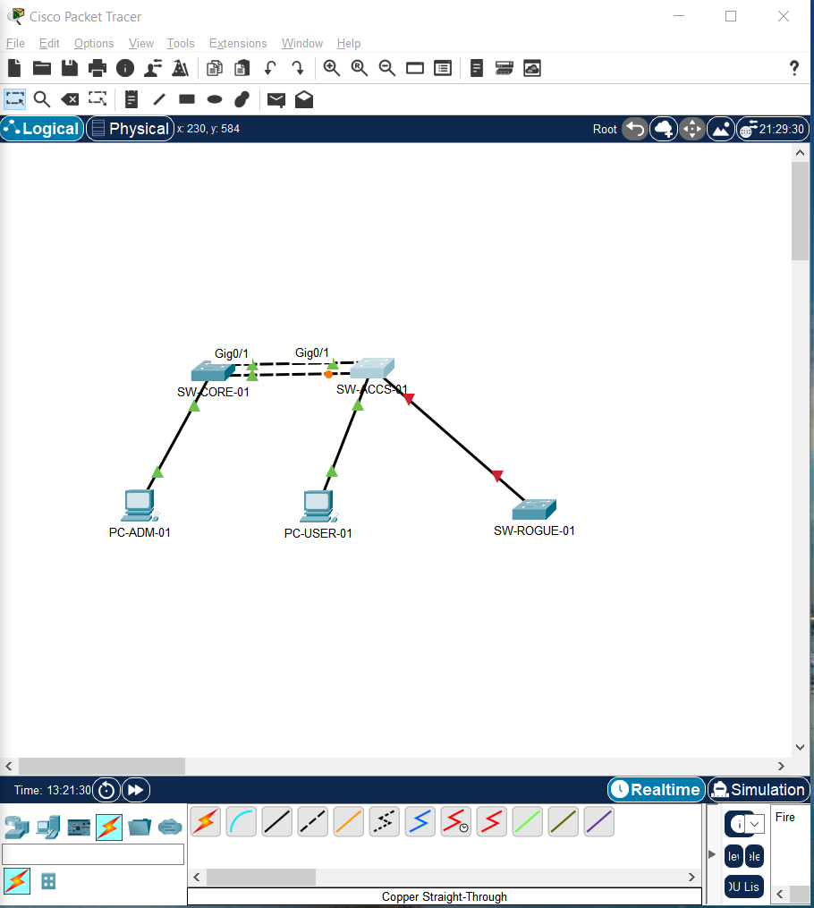
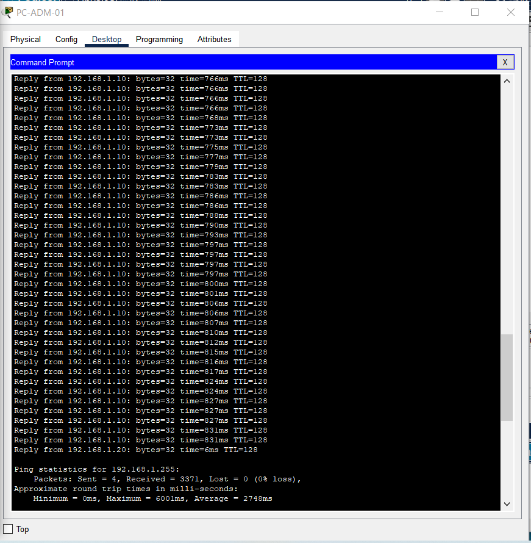
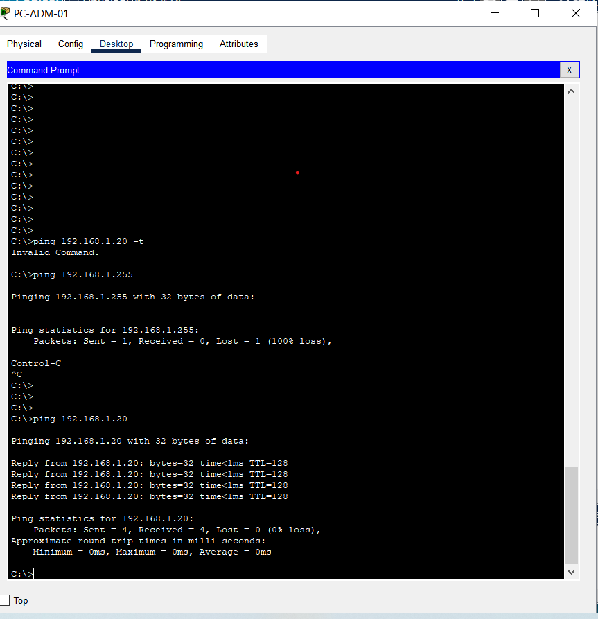
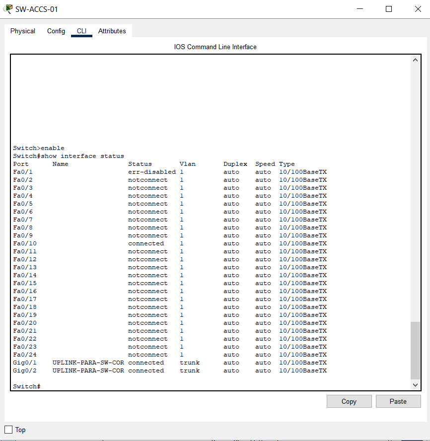

# 🛡️ Prevenção de Loops e Hardening L2 em Redes Cisco


Este repositório contém a simulação prática, arquitetura e documentação de um laboratório focado em **diagnóstico de loops de Camada 2**, **contenção de Broadcast Storms** e **mecanismos de proteção L2 (BPDU Guard e PortFast)** em switches Cisco Catalyst.

---

## 📐 Topologia da Rede

A topologia foi desenhada seguindo o modelo de hierarquia de redes Cisco (Camada de Distribuição e Camada de Acesso).



### Equipamentos e Endereçamento
* **`SW-CORE-01` (Cisco 2960):** Switch de Distribuição / Root Bridge Primário
* **`SW-ACCS-01` (Cisco 2960):** Switch de Acesso / Root Bridge Secundário
* **`SW-ROGUE-01` (Cisco 2960):** Switch não autorizado conectado para testes de segurança
* **`PC-ADM-01`:** `192.168.1.10/24` (VLAN 1)
* **`PC-USER-01`:** `192.168.1.20/24` (VLAN 1)

---

## 🧪 Cenários Práticos e Validações

### 1. Simulação e Diagnóstico de Broadcast Storm
Com o Spanning Tree Protocol desativado intencionalmente em links redundantes (`GigabitEthernet0/1` e `GigabitEthernet0/2`), um disparo de pacote direcionado ao endereço de broadcast (`192.168.1.255`) provocou um anel de Camada 2.

* **Sintoma:** Multiplicação exponencial de pacotes e saturação do buffer dos equipamentos.
* **Resultado Obtido:** **4 pacotes enviados geraram 3.371 respostas de echo local**, comprovando a colisão e colapso do tráfego.



---

### 2. Contenção e Normalização via Spanning Tree Protocol (STP)
Ao reativar o STP nos switches, o algoritmo de eleição definiu o `SW-CORE-01` como Root Bridge e colocou a porta redundante `GigabitEthernet0/2` no `SW-ACCS-01` em estado de bloqueio (`BLK` / Alternate Blocking).

* **Validação:** Disparo de tráfego Unicast direto do `PC-ADM-01` para o `PC-USER-01`.
* **Resultado Obtido:** **4 pacotes enviados e 4 pacotes recebidos (0% de perda)** com latência mínima e sem duplicação de tráfego.



---

### 3. Hardening de Portas de Acesso (BPDU Guard & PortFast)
Para evitar que um dispositivo não autorizado seja inserido na infraestrutura (gerando potenciais novos loops ou hijacking do Root Bridge), as portas de acesso foram configuradas com **PortFast** e **BPDU Guard**.

* **Teste:** Conexão da porta `FastEthernet0/1` do `SW-ACCS-01` ao `SW-ROGUE-01`.
* **Resultado Obtido:** Assim que o switch não autorizado transmitiu o primeiro BPDU, a interface do switch de acesso transitou imediatamente para o estado **`err-disabled`**, isolando o risco automaticamente.



---

## ⚙️ Comandos Utilizados (Cisco IOS)

### Configuração no SW-CORE-01
```bash
enable
configure terminal
hostname SW-CORE-01
spanning-tree vlan 1 root primary

interface range GigabitEthernet0/1 - 2
 description UPLINK-PARA-SW-ACCS-01
 switchport mode trunk
 exit
